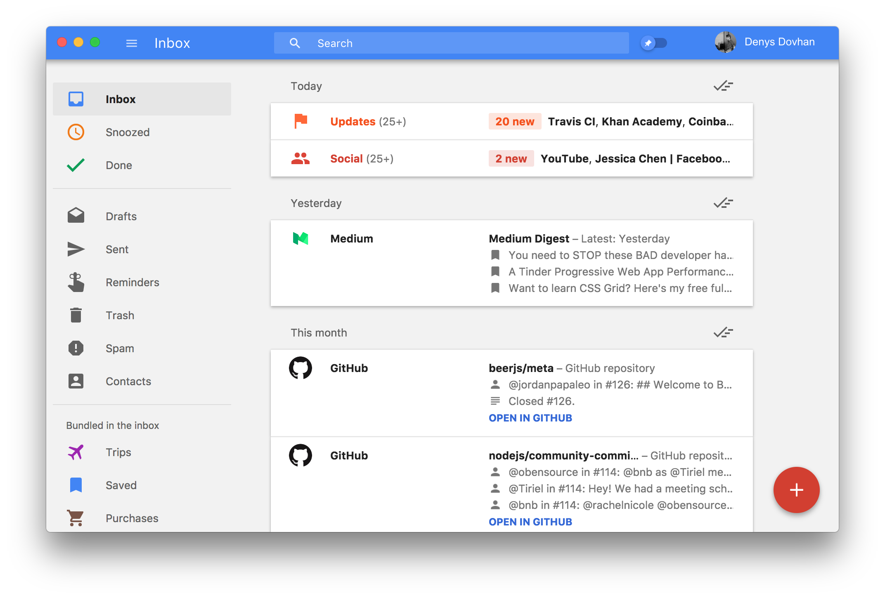

> ## 🚧 This project is deprecated! 🚧
>
> As you know Google is going to take down Inbox service.
>
> **This project is not maintained anymore. Since Inbox is closed this project has to be closed as well. It just cannot operate normally without Inbox.**
>
> You can find more information [here](https://github.com/denysdovhan/inboxer/issues/101).

<div align="center">
  
  <h1>Inboxer</h1>
  <p>
    <a href="https://github.com/denysdovhan/inboxer/releases"></a>
    <a href="https://travis-ci.org/denysdovhan/inboxer?branch=master"></a>
    
    <a href="https://www.liqpay.com/en/checkout/380951100392"></a>
    <a href="https://github.com/denysdovhan/inboxer#donate"></a>
    <a href="https://github.com/denysdovhan/inboxer#donate"></a>
  </p>
</div>

> Unofficial, free and open-source Google Gmail Desktop App

Inboxer — started out as an unofficial Inbox by Gmail client for desktop platforms. However, Google plans to discontinue Inbox at the end of March 2019 ([see official announcement](https://www.blog.google/products/gmail/inbox-signing-find-your-favorite-features-new-gmail/)). To keep Inboxer alive we have converted it to work with Gmail. Inboxer is now built on top of Gmail web-version. It has pleasant UI and supports useful keyboard shortcuts.

Inboxer is highly inspired by these projects:

* [Caprine](https://github.com/sindresorhus/caprine) by [Sindre Sorhus](https://github.com/sindresorhus)
* [Ramme](https://github.com/terkelg/ramme) by [Terkel Gjervig Nielsen](https://github.com/terkelg)
* [Keep](https://github.com/andrepolischuk/keep) by [Andrey Polischuk](https://github.com/andrepolischuk)

Check out these ones as great examples of Electron applications. All of them are under the MIT license.

## Features

* Familiar Gmail interface
* Cross-platform (macOS/Linux/Windows)
* Useful Keyboard shortcuts
* Multiple accounts
* Optional Always on Top
* Auto-updates to the latest version
* Desktop notifications
* **TODO:** Dark theme
* **TODO:** Custom text size
* **TODO:** Ability to use as default mail client

All feature requests and contributions are welcome!

## Screenshot

* **TODO:** Update screenshot to show latest version working with Gmail


## Installation

Inboxer works well on **macOS 10.9+**, **Linux** and **Windows 7+**. You can download the latest version on [Releases](https://github.com/denysdovhan/inboxer/releases) page or below.
Inboxer is also available through the nix package manager (see [package in nix](https://nixos.org/nixos/packages.html#inboxer))

### macOS

[**Download**][download] the `.dmg` file or install via [Homebrew-Cask](https://caskroom.github.io/):

```
$ brew cask install inboxer
```

### Linux

[**Download**][download] the `.AppImage`* or `.deb` or `.snap` file.

\* — Notice, that the `AppImage` needs to be [made executable](http://discourse.appimage.org/t/how-to-make-an-appimage-executable/80) after download.

### Windows

[**Download**][download] the `.exe` file.

### Package Inboxer from source

You'll need `electron` and `npm` installed in your system.
[**Download**][download] and extract the source code (`.zip` or `.tar.gz` file).
Inside the source code folder, run:
```
$ npm install
```
Then package the app with:
```
$ npm run dist
```
This builds packages for all architectures. Use `dist:mac`, `dist:linux`, or `dist:win` to package a single architecture. The packages will be found in the `dist` folder.

## Keyboard shortcuts

Inboxer supports all Gmail keyboard shortcuts, system-specific keybindings and more. Additional keybindings are listed below:

| Description                  | Keys
|------------------------------|---------
| Preferences                  | <kbd>Cmd/Ctrl</kbd> <kbd>P</kbd>
| Compose Message              | <kbd>Cmd/Ctrl</kbd> <kbd>N</kbd>
| Go to Inbox                  | <kbd>Cmd/Ctrl</kbd> <kbd>I</kbd>
| Go to Snoozed                | <kbd>Cmd/Ctrl</kbd> <kbd>S</kbd>
| Go to Done                   | <kbd>Cmd/Ctrl</kbd> <kbd>D</kbd>
| Drafts                       | <kbd>Cmd/Ctrl</kbd> <kbd>Shift</kbd> <kbd>D</kbd>
| Sent                         | <kbd>Cmd/Ctrl</kbd> <kbd>Shift</kbd> <kbd>S</kbd>
| Trash                        | <kbd>Alt</kbd> <kbd>Shift</kbd> <kbd>T</kbd>
| Spam                         | <kbd>Alt</kbd> <kbd>Shift</kbd> <kbd>S</kbd>
| Open Contacts                | <kbd>Cmd/Ctrl</kbd> <kbd>Shift</kbd> <kbd>C</kbd>
| Search                       | <kbd>Cmd/Ctrl</kbd> <kbd>F</kbd>
| Toggle Sidebar               | <kbd>Cmd/Ctrl</kbd> <kbd>/</kbd>
| Toggle "Always on Top"       | <kbd>Cmd/Ctrl</kbd> <kbd>Shift</kbd> <kbd>T</kbd>
| Keyboard Shortcuts Reference | <kbd>Shift</kbd> <kbd>/</kbd> or <kdb>?</kdb>
| Toggle Developer Tools       | <kbd>Option</kbd> <kbd>Cmd</kbd> <kbd>I</kbd> _(macOS)_ or <kbd>Ctrl</kbd> <kbd>Shift</kbd> <kbd>I</kbd>

## Disclaimer

This code is in no way affiliated with, authorised, maintained, sponsored or endorsed by Google or any of its affiliates or subsidiaries. This is an independent and unofficial Gmail app. Use it at your own risk.

## End User License Agreement

* You **will not** use this repository for sending mass spam or any other malicious activity.
* We / You **will not** support anyone who is violating this EULA conditions.
* Repository is just for learning / personal purposes thus **should not** be part of any service available on the Internet that is trying to do any malicious activity (mass bulk request, spam etc).

## Donate

Hi! I work on this project in my spare time, beside my primary job. I hope enjoy using Inboxer, and if you do, please, [support this project 🙏🏻][donate-card-url].

| Credit/Debit card | Bitcoin | Ethereum |
|:-----------------:|:-------:|:--------:|
| [Donate with LiqPay][donate-card-url] | `1FrPrQb6ACTkbSBAz9PduJWrDFfq41Ggb4` | `0x6aF39C917359897ae6969Ad682C14110afe1a0a1` |
|  |  |  |

I would appreciate your support! _Thank you!_

[donate-readme]: https://github.com/denysdovhan/inboxer#donate
[donate-card-url]: https://www.liqpay.com/en/checkout/380951100392
[donate-card-image]: https://img.shields.io/badge/donate-LiqPay-blue.svg?style=flat-square
[donate-btc-image]: https://img.shields.io/badge/donate-BTC-yellow.svg?style=flat-square
[donate-eth-image]: https://img.shields.io/badge/donate-ETH-gray.svg?style=flat-square

## License

MIT © [Denys Dovhan](http://denysdovhan.com)

<!-- References -->

[download]: https://github.com/denysdovhan/inboxer/releases/latest
